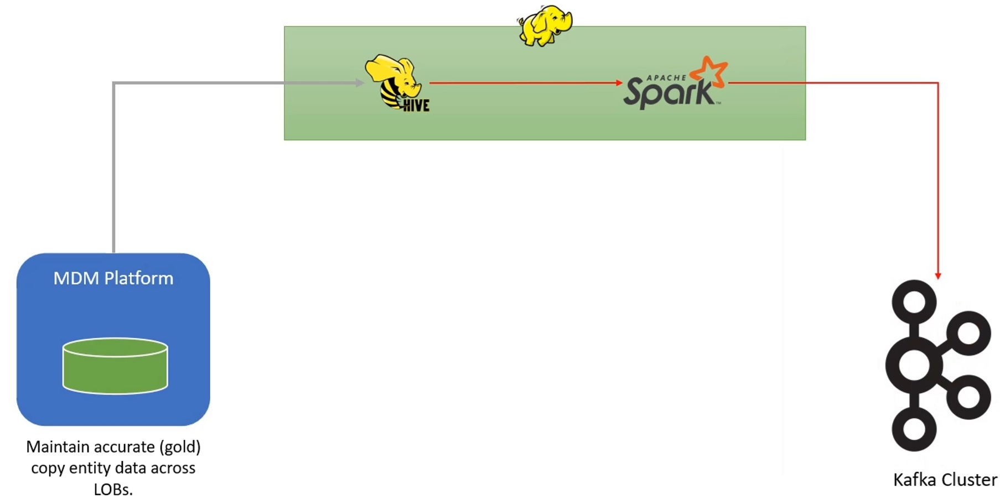
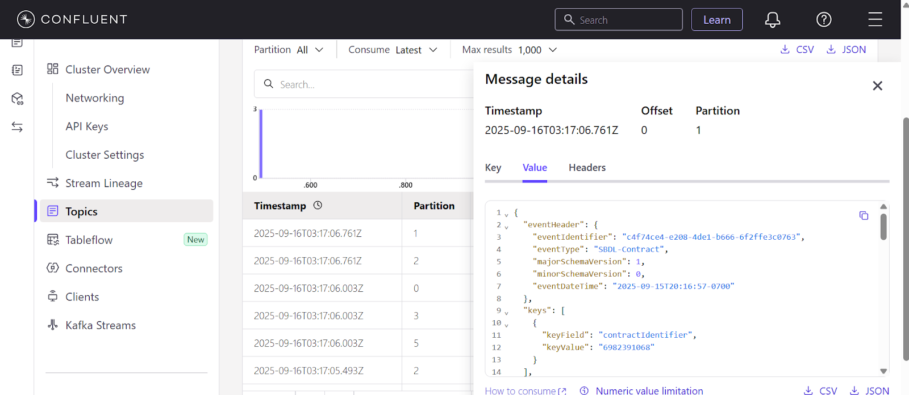

# Spark Bulk Load Application with Kafka

This project demonstrates a scalable data engineering pipeline that reads entity data from Hive tables, performs complex transformations using PySpark, and streams the resulting structured JSON messages to an Apache Kafka topic. The entire process is automated using a CI/CD pipeline built with Jenkins on Google Cloud Platform (GCP).

[](https://www.python.org/downloads/)
[](https://spark.apache.org/)
[](https://kafka.apache.org/)
[](https://www.jenkins.io/)
[](https://cloud.google.com/)

---

## 📝Project Overview

The primary goal of this project is to process raw entity data stored in Hive and publish it to a Kafka cluster for consumption by downstream applications. The initial implementation focuses on the "Account" entity, which is composed of data from three distinct Hive tables: `accounts`, `parties`, and `addresses`.

The pipeline reads data for each unique account, combines it with its associated parties and their respective addresses, and transforms it into a specific, nested JSON format before producing it to a Kafka topic.

## 🧩High-Level Architecture

* **Source:** Apache Hive tables containing raw entity data.
* **Processing Engine:** **Apache Spark** processes, merges data from multiple tables and transforms data to the required JSON format.
* **Destination:** An Apache Kafka cluster for real-time data streaming.

---

## 📂 Repository Structure  

```
spark-bulk-load-application-with-kafka/
│── __pycache__/         # Python cache files
│── conf/                # Configuration files
│── lib/                 # Utility functions and reusable libraries
│── test_data/           # Sample input & output test data
│── .gitignore           # Git ignore rules
│── Jenkinsfile          # CI/CD pipeline definition
│── Pipfile              # Python dependencies
│── Pipfile.lock         # Dependency lock file
│── README.md            # Project documentation
│── log4j.properties     # Logging configuration
│── main.py              # Main Spark application
│── sbdl_submit.sh       # Spark submit script
│── test_pytest_sbdl.py  # Pytest cases
│── project_scope.jpg    # Project high level architecture
│── output.png           # Kafka output screenshot
```

---

## Data Transformation Details

The core of this project is the transformation logic that converts raw tabular data into a standardized JSON message structure.

### Input CSV Data

The pipeline consumes data from three main sources (provided as CSV files for local testing):
1.  **Accounts Table:** Contains primary account information like `account_id`, `account_start_date`, `legal_title_1`, `legal_title_2`, etc.
2.  **Parties Table:** Links parties (`party_id`) to accounts (`account_id`), defining relationships (many-to-one relationship).
3.  **Address Table:** Contains address details for each party (`party_id`).

### Transformation Rules  
- Combine account + parties + addresses → single **Account Entity record**.  
- Create **event header** with:  
  - `eventIdentifier`: UUID (dynamically generated)  
  - `eventType`: `SBDL-Contract`  
  - `majorSchemaVersion` / `minorSchemaVersion`: fixed versioning  
  - `eventDateTime`: current system timestamp  

- **Key Section**: JSON array containing `contractIdentifier` = `accountId`.  
- **Payload Section**:  
  - Each field represented with `{operation, oldValue, newValue}`.  
  - Current phase → only `INSERT` operations (oldValue = null).  
  - Legal titles merged into an array.  
  - Parties embedded with addresses under `partyRelations`.  

Example: For 10 unique accounts → produce 10 JSON messages → publish to Kafka topic.  

### Output JSON Structure


Each record sent to Kafka is a JSON message with three main components: `eventHeader`, `keys`, and `payload`.

#### 1. `eventHeader`
Contains metadata about the event.
* `eventIdentifier`: A dynamically generated UUID for each record.
* `eventType`: A fixed string, e.g., `"SBDL-Contract"` for the account entity.
* `majorSchemaVersion` / `minorSchemaVersion`: Fixed version numbers.
* `eventDateTime`: The current system timestamp when the event is generated.

#### 2. `keys`
A JSON array that defines the primary key(s) of the entity. For the account entity, this contains a single object identifying the account.
* `keyField`: The name of the key, e.g., `"contractIdentifier"`.
* `keyValue`: The value of the key, which is the `account_id`.

#### 3. `payload`
Contains the actual transformed data. Each field within the payload is a struct with `operation`, `oldValue`, and `newValue`.
* **`operation`**: For this project, the value is always `"INSERT"`.
* **`oldValue`**: Always `null` for INSERT operations and is omitted from the final JSON.
* **`newValue`**: The actual value from the source data.

**Key Payload Transformations:**
* **`contractIdentifier`**: Maps to the `account_id`.
* **`contractTitle`**: An array that combines `legal_title_1` and `legal_title_2` into a single list.
* **`partyRelations`**: A nested array containing all parties associated with the account. Each element includes the party's identifier, relationship type, start date, and a nested `partyAddress` object.

---

## 🚀 Development & Deployment Flow  

- **Master** → Production environment  
- **Release** → QA Testing environment  
- **Dev** → Development environment  

---

## ⚙️ CI/CD Pipeline 

1. **Source Control**: GitHub branching strategy (feature → dev → release → master).  
2. **Jenkins Setup**:  
   - Install Jenkins on GCP VM instance  
   - Configure system, create tokens & webhooks  
   - Use Jenkinsfile for build & deploy stages  
3. **Pipeline Stages**:  
   - Dependency installation (Pipenv)  
   - Linting & unit testing (pytest, nutter)  
   - Spark job packaging  
   - Deployment to GCP + Kafka integration  

---

## 🧪 Testing  

- **Pytest** → unit & functional tests (`test_pytest_sbdl.py`)
- **Test Data** → available in `test_data/`  

---

## 🔑 Steps to Run  

1. Clone the repo:  
   ```bash
   git clone https://github.com/panditpooja/spark-bulk-load-application-with-kafka.git
   cd spark-bulk-load-application-with-kafka
   ```
2. Install dependencies:  
   ```bash
   pip install pipenv
   pipenv install
   ```
3. Submit job to Spark:  
   ```bash
   sh sbdl_submit.sh
   ```
4. Run tests:  
   ```bash
   pytest test_pytest_sbdl.py
   python test_nutter_sbdl.py
   ```
5. Check Kafka topic for JSON messages.  

---

##  📚Technology Stack

* **Programming Language:** Python 3.13
* **Data Processing:** Apache Spark 4.0.0 (PySpark)
* **Messaging System:** Apache Kafka
* **CI/CD:** Jenkins
* **Cloud Platform:** Google Cloud Platform (GCP) for Jenkins hosting.
* **Dependency Management:** Pipenv

---

## ✍️ Author
**Pooja Pandit**  
Master’s Student in Information Science (Machine Learning)  
The University of Arizona  

[](https://github.com/panditpooja)
[](https://www.linkedin.com/in/pooja-pandit-177978135/)
